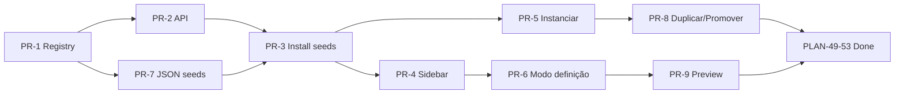

# Plano: Modelos de Projeto (onda 1 + onda 2)

## Contexto

A feature **Tipo de workspace + Terminologia** (PLAN-41–48) já está entregue: `workspace_type` persiste no backend, registry em `packages/constants/src/workspace-types/` e hooks `useWorkspaceType` / `useEntityTerm` / `useTerminologyT`.

As tarefas **PLAN-49–53** ficaram **Blocked** de propósito — seriam uma segunda arquitetura de templates (`is_template` isolado, biblioteca ad hoc, seeds soltos). Toda a v2 passa a ser implementada pelo epic **Modelos de Projeto** (PLAN-61+), alinhado à page **[01.04 — Escopo Modelos de Projeto](https://plane.agncflamingo.com.br/plan-sprint/projects/b42cb7d4-2630-4f5d-84eb-26c5dde212b4/pages/e9935fb9-9e5c-4356-9880-16d14c389676/)**.

**Escopo deste plano:** implementar **as duas ondas de uma vez** — infra completa + **14 seeds** + UX Must/Should. Itens **Could** (PLAN-87–88) ficam como fase opcional no final.

### Estado atual no código

| Área                            | Situação                                                                                                                                                                                                  |
| ------------------------------- | --------------------------------------------------------------------------------------------------------------------------------------------------------------------------------------------------------- |
| `Project.is_template`           | **Não existe** — [`apps/api/plane/db/models/project.py`](apps/api/plane/db/models/project.py)                                                                                                             |
| `ProjectTemplate` / API CRUD    | **Não existe**                                                                                                                                                                                            |
| Seeds JSON `project-templates/` | **Não existe**                                                                                                                                                                                            |
| `ProjectTemplateSelect` (CE)    | Stub vazio — [`apps/web/ce/components/projects/create/template-select.tsx`](apps/web/ce/components/projects/create/template-select.tsx)                                                                   |
| i18n `template.json`            | Existe (Plane EE copy) — reutilizar chaves onde couber                                                                                                                                                    |
| Duplicar projeto                | **Não existe** — só duplicar Page ([`PageDuplicateEndpoint`](apps/api/plane/app/views/page/base.py))                                                                                                      |
| Padrão de cópia em lote         | Referência: [`workspace_seed_task.py`](apps/api/plane/bgtasks/workspace_seed_task.py) (states, labels, modules, issues)                                                                                   |
| Sidebar pinnável                | Referência: Squads — [`SidebarSprintsList`](apps/web/core/components/workspace/sidebar/sprints-list.tsx), chave `"squads"` em [`navigation-preferences.ts`](packages/types/src/navigation-preferences.ts) |
| Terminologia por vertical       | Pronta — 10 tipos, ondas 1 e 2 no registry                                                                                                                                                                |

### Tarefas Plane — mapa de cobertura

| Task       | Conteúdo                                          | Coberto por fase     |
| ---------- | ------------------------------------------------- | -------------------- |
| PLAN-49    | `is_template` + duplicar projeto                  | PR-2, PR-5, PR-8     |
| PLAN-50    | Biblioteca no workspace                           | PR-4, PR-6           |
| PLAN-51    | Seeds Lançamentos Digitais                        | PR-1, PR-3, PR-7     |
| PLAN-52    | Duplicação granular (promover / copiar estrutura) | PR-5, PR-8           |
| PLAN-53    | Overrides avançados + API pública                 | PR-10 (Could)        |
| PLAN-61    | Epic MVP onda 1                                   | PR-1 … PR-9          |
| PLAN-62    | Epic onda 2 (seeds verticais)                     | PR-7 (mesma entrega) |
| PLAN-63    | Registry `WORKSPACE_TYPE_DEFAULT_TEMPLATES`       | PR-1                 |
| PLAN-64    | Modelo + API `ProjectTemplate`                    | PR-2                 |
| PLAN-65    | UI grid filtrada                                  | PR-4, PR-6           |
| PLAN-66    | Instalação idempotente de seeds                   | PR-3                 |
| PLAN-67    | Instanciar ao criar projeto                       | PR-5                 |
| PLAN-68    | Modo definição                                    | PR-6                 |
| PLAN-69–76 | Seeds onda 1 (9)                                  | PR-7                 |
| PLAN-77–79 | Duplicar, preview, config menu                    | PR-8, PR-9           |
| PLAN-80–86 | Seeds onda 2 (6)                                  | PR-7                 |
| PLAN-87–88 | Variáveis `{cliente}`, import/export JSON         | PR-10 (Could)        |

---

## Princípios (não negociáveis)

1. **Modelo ≠ projeto operacional** — modelo vive em **modo definição**; instância é projeto real com board, analytics e tracking.
2. **`workspace_type` é o eixo de filtragem** — seeds pré-definidos visíveis só para o tipo atual; custom permanece ao trocar tipo.
3. **Uma arquitetura só** — não reativar PLAN-49–53 fora deste epic; ao concluir PR-9, marcar PLAN-49–53 como Done/Superseded.
4. **Instanciação copia estrutura, não execução** — states, labels, modules, tasks (nome, descrição, hierarquia, labels); **sem** assignees, datas, comentários, progresso.
5. **Estado inicial por vertical** — tasks resetadas para `default_state` do workflow (Backlog em dev/default; Rascunho/Não iniciado/Brief etc. nos demais).
6. **Seeds idempotentes** — `(workspace_id, seed_id)` único; reinstalar ou trocar tipo não duplica catálogo.
7. **Rotas de projeto existentes** — modelo usa shell de projeto com guard rails, não inventar CRUD paralelo de modules/issues.
8. **CE-first** — implementação em `apps/web/ce` + `apps/api`; stubs EE permanecem onde já existem.

---

## Arquitetura alvo

```
workspace_type (✓ entregue)
  └─ WORKSPACE_TYPE_REGISTRY
       └─ WORKSPACE_TYPE_DEFAULT_TEMPLATES (novo — PR-1)
            └─ packages/constants/src/project-templates/seeds/*.json (14 arquivos — PR-7)
                 └─ install_workspace_templates() (PR-3)
                      └─ WorkspaceProjectTemplate (metadados workspace — PR-2)
                           └─ project_id → Project(is_template=True) (autoring shell — PR-2)
                                ├─ Sidebar + grid (PR-4, PR-6)
                                ├─ Modo definição — guards (PR-6)
                                ├─ instantiate_template() → Project operacional (PR-5)
                                ├─ duplicate_template() (PR-8)
                                └─ promote_project_to_template() (PR-8)
```

### Modelo de dados proposto

**`WorkspaceProjectTemplate`** (workspace-scoped, espelha padrão Squads)

| Campo                 | Tipo               | Notas                                               |
| --------------------- | ------------------ | --------------------------------------------------- |
| `id`                  | UUID               | PK                                                  |
| `workspace`           | FK                 |                                                     |
| `name`                | string             | Nome exibido na biblioteca                          |
| `description`         | text               |                                                     |
| `seed_id`             | string, nullable   | ex.: `launch_classic_internal`; null = custom       |
| `workspace_type`      | enum, nullable     | Tipo alvo do seed; null = custom universal          |
| `is_system`           | bool               | true = seed pré-definido (read-only estrutural)     |
| `is_default_for_type` | bool               | ex.: Clássico Interno default em `digital_launches` |
| `project`             | FK → Project       | Projeto `is_template=True` usado no authoring       |
| `sort_order`          | float              | Ordenação sidebar/grid                              |
| `logo_props`          | JSON               |                                                     |
| `archived_at`         | datetime, nullable |                                                     |

**`Project`** — campos novos:

| Campo                | Tipo                | Notas                                     |
| -------------------- | ------------------- | ----------------------------------------- |
| `is_template`        | bool, default false | Guard em queries de projetos operacionais |
| `template_source_id` | FK self, nullable   | Projeto de origem ao promover             |

**Constraint:** `UniqueConstraint(workspace, seed_id)` onde `seed_id IS NOT NULL AND deleted_at IS NULL`.

### API (REST)

Base: `/api/workspaces/{slug}/project-templates/`

| Método | Rota                              | Ação                                                              |
| ------ | --------------------------------- | ----------------------------------------------------------------- |
| GET    | `/`                               | Listar (filtro implícito por `workspace.workspace_type` + custom) |
| POST   | `/`                               | Criar modelo vazio (cria Project template + registro)             |
| GET    | `/{id}/`                          | Detalhe                                                           |
| PATCH  | `/{id}/`                          | Editar metadados (nome, descrição, sort_order)                    |
| DELETE | `/{id}/`                          | Arquivar (soft)                                                   |
| POST   | `/{id}/duplicate/`                | Duplicar modelo → novo custom                                     |
| POST   | `/{id}/instantiate/`              | Criar projeto operacional a partir do modelo                      |
| POST   | `/install-seeds/`                 | Idempotente — admin only                                          |
| POST   | `/projects/{project_id}/promote/` | Promover projeto → modelo custom (PLAN-11)                        |

Query params úteis: `?include_archived=true`, `?workspace_type=` (override admin).

### Serviço de cópia (`project_template_service.py`)

Funções centrais (reutilizadas por seed install, instantiate, duplicate, promote):

```python
copy_project_structure(
    source_project,
    target_project,
    *,
    reset_issue_states: bool = True,
    copy_assignees: bool = False,
    copy_dates: bool = False,
    copy_comments: bool = False,
) -> CopyResult
```

Ordem de cópia (espelhar `workspace_seed_task`):

1. States (+ `default_state` mapping)
2. Labels
3. Modules (+ sort order)
4. Issues (+ parent hierarchy, module links, label links)
5. Issue types / properties se `is_issue_type_enabled`

**Não copiar:** cycles ativos, views, pages, membros, analytics snapshots, webhooks.

### Registry de seeds (PR-1)

Novo módulo: `packages/constants/src/project-templates/`

```typescript
// registry.ts
export const WORKSPACE_TYPE_DEFAULT_TEMPLATES: Record<EWorkspaceType, TTemplateSeedRef[]> = {
  [EWorkspaceType.DIGITAL_LAUNCHES]: [
    { seedId: "launch_seed", wave: 1, isDefault: false },
    { seedId: "launch_classic_internal", wave: 1, isDefault: true },
    // ...
  ],
  // ...
};

export const TEMPLATE_SEED_CATALOG: Record<string, TTemplateSeedMeta> = {
  launch_classic_internal: {
    seedId: "launch_classic_internal",
    i18n: { en: "Classic Launch (Internal)", "pt-BR": "Lançamento Clássico (Interno)" },
    workspaceTypes: [EWorkspaceType.DIGITAL_LAUNCHES],
    wave: 1,
    moduleCount: 7,
    issueCount: 21,
  },
  // 14 entradas
};
```

Formato JSON de seed (`seeds/launch_classic_internal.json`):

```json
{
  "seedId": "launch_classic_internal",
  "workspaceTypes": ["digital_launches"],
  "defaultIssueState": "Rascunho",
  "states": [{ "name": "Rascunho", "group": "unstarted", "color": "#..." }],
  "labels": [{ "name": "copy", "color": "#..." }],
  "modules": [{ "name": "Estratégia e planejamento", "sort_order": 1 }],
  "issues": [
    {
      "name": "Persona e oferta",
      "module": "Estratégia e planejamento",
      "labels": ["copy"],
      "priority": "none"
    }
  ]
}
```

### Catálogo completo — 14 seeds (onda 1 + 2)

| seedId                      | Nome                             | workspace_type       | Módulos | Tasks | Default state | Onda |
| --------------------------- | -------------------------------- | -------------------- | ------: | ----: | ------------- | ---- |
| `default_generic_project`   | Projeto Genérico                 | default              |       3 |     9 | Backlog       | 1    |
| `civil_residential`         | Obra Residencial                 | civil_engineering    |       7 |    28 | Não iniciado  | 1    |
| `launch_seed`               | Lançamento Semente               | digital_launches     |       6 |    18 | Rascunho      | 1    |
| `launch_classic_internal`   | Lançamento Clássico (Interno)    | digital_launches     |       7 |    21 | Rascunho      | 1 ★  |
| `launch_perpetual_funnel`   | Lançamento Perpétuo              | digital_launches     |       6 |    18 | Rascunho      | 1    |
| `launch_meteoric`           | Lançamento Meteórico             | digital_launches     |       5 |    15 | Rascunho      | 1    |
| `launch_high_ticket`        | Lançamento High Ticket           | digital_launches     |       6 |    18 | Rascunho      | 1    |
| `dev_feature_delivery`      | Entrega de Feature               | software_development |       5 |    20 | Backlog       | 1    |
| `agency_marketing_campaign` | Campanha de Marketing            | marketing_agency     |       5 |    18 | Rascunho      | 2    |
| `cs_account_success_plan`   | Plano de Sucesso da Conta        | customer_success     |       5 |    15 | Não iniciado  | 2    |
| `legal_advisory_case`       | Caso Jurídico — Consultivo       | legal                |       6 |    18 | Aberto        | 2    |
| `edu_course_term`           | Curso — Ciclo Letivo             | education            |       5 |    15 | Rascunho      | 2    |
| `events_corporate`          | Evento Corporativo               | events               |       6 |    18 | Ideação       | 2    |
| `design_brand_job`          | Job Criativo — Identidade Visual | design_creative      |       5 |    15 | Brief         | 2    |

★ = `is_default_for_type` em `digital_launches`.

Conteúdo detalhado (estados, labels, módulos, tasks): page `01.04`.

---

## Modo definição vs modo execução

| Aspecto               | Modo definição (modelo)            | Modo execução (projeto)          |
| --------------------- | ---------------------------------- | -------------------------------- |
| Onde                  | `/[slug]/templates/[templateId]/…` | `/[slug]/projects/[projectId]/…` |
| `Project.is_template` | `true`                             | `false`                          |
| Board / analytics     | Ocultos ou read-only banner        | Normal                           |
| Assignees / datas     | Placeholder opcional               | Operacional                      |
| Cycles / sprints      | Desabilitados                      | Conforme projeto                 |
| Time tracking         | Off                                | Conforme settings                |

### Guards (frontend)

Hook `useProjectTemplateMode(projectId)`:

- Se `is_template`: redirecionar rotas proibidas (`/analytics`, `/cycles`, `/modules/[id]/issues` board view) para overview do modelo.
- Banner persistente: "Modo modelo — estrutura de referência" + CTA **Instanciar projeto**.
- Esconder intake, automations, estimates operacionais.

### Guards (backend)

- Endpoints de analytics, cycle create, time log: retornar `403` se `project.is_template`.
- Listagens de projetos do workspace: excluir `is_template=True` por padrão (`ProjectViewSet` filter).

---

## UX (espelho Squads)

### Sidebar (PR-4)

1. Nova chave de navegação: `"project_templates"` em `TWorkspaceNavigationItemKey`.
2. Default: `is_pinned: false` (admin pode fixar via Customize navigation).
3. Componente `SidebarProjectTemplatesList` — accordion como [`SidebarSprintsList`](apps/web/core/components/workspace/sidebar/sprints-list.tsx).
4. Label via terminologia: `useTerminologyT("templates.sidebar.title")` → "Modelos de Projeto" / "Project Templates".
5. Rotas novas em [`apps/web/app/routes/core.ts`](apps/web/app/routes/core.ts):
   - `/:workspaceSlug/templates` — grid
   - `/:workspaceSlug/templates/:templateId` — redirect para shell do projeto template
   - `/:workspaceSlug/templates/:templateId/work-items` — authoring

### Grid (PR-6)

- Cards: nome, descrição, badge **Pré-definido** / **Custom**, contagem módulos/tasks.
- Filtro automático: seeds do `workspace_type` + custom do workspace.
- Ações: Abrir, Duplicar (custom only ou duplicar seed → custom), Arquivar (custom only).
- Empty state por vertical (ex.: digital_launches mostra 5 cards após install).

### Criar projeto (PR-5)

Substituir stub [`ProjectTemplateSelect`](apps/web/ce/components/projects/create/template-select.tsx):

1. Dropdown / modal com templates visíveis + opção "Projeto em branco".
2. Ao selecionar: POST `instantiate` com `{ name, identifier, … }` **ou** create project + apply template in one transaction.
3. Default pré-selecionado: seed com `is_default_for_type` (Clássico Interno em digital_launches).

### Preview (PR-9 — Should)

Modal read-only antes de instanciar: lista módulos, contagem tasks, workflow states (sem abrir projeto).

---

## Fases de implementação

### Fase 0 — Preparação (0,5 dia)

- [ ] Ler page `01.04` e validar 14 seeds contra produto (nomes/states já documentados).
- [ ] Criar branch `feat/PLAN-61-project-templates` ([branch-name skill](.claude/skills/branch-name/SKILL.md)).
- [ ] Marcar PLAN-61 **In Progress** no Plane.
- [ ] Documentar decisão arquitetural (este plano) num comentário em PLAN-61.

### PR-1 — Registry + tipos (PLAN-63) — ~1 dia

**Arquivos novos**

- `packages/constants/src/project-templates/registry.ts`
- `packages/constants/src/project-templates/types.ts`
- `packages/constants/src/project-templates/index.ts`
- `packages/types/src/project-template.ts`

**Entregáveis**

- [ ] `WORKSPACE_TYPE_DEFAULT_TEMPLATES` para 10 tipos
- [ ] `TEMPLATE_SEED_CATALOG` com metadados dos 14 seeds
- [ ] Export em `@plane/constants` e `@plane/types`
- [ ] Teste unitário: todo `seedId` referenciado no registry tem entrada no catálogo

**Validação:** `pnpm --filter=@plane/constants build && pnpm --filter=@plane/constants test`

---

### PR-2 — Backend: modelos + migration + API CRUD (PLAN-64) — ~2 dias

**Backend**

- [ ] Migration `0133_project_is_template.py` — `Project.is_template`, `Project.template_source_id`
- [ ] Migration `0134_workspace_project_template.py` — model + constraints
- [ ] `apps/api/plane/db/models/project_template.py`
- [ ] Serializers + permissions (workspace ADMIN/MEMBER create; system seed PATCH limitado)
- [ ] ViewSet `WorkspaceProjectTemplateViewSet`
- [ ] URLs em `apps/api/plane/app/urls/project_template.py`
- [ ] Excluir `is_template=True` das listagens default de projetos

**Frontend (tipos + service skeleton)**

- [ ] `apps/web/core/services/project-template.service.ts`
- [ ] `packages/types` interfaces `IWorkspaceProjectTemplate`, payloads

**Testes**

- [ ] Contract: list/create/get/patch/archive
- [ ] Permission: guest read-only; system seed não deletável
- [ ] Unit: serializer validation `seed_id` + `workspace_type` consistency

**Validação:** `docker compose -f docker-compose-test.yml run --rm api-tests pytest plane/tests/contract/api/test_project_templates.py -v`

---

### PR-3 — Instalação idempotente de seeds (PLAN-66) — ~2 dias

**Backend**

- [ ] `apps/api/plane/utils/project_template_seed.py` — lê JSON, cria Project template + issues
- [ ] `install_workspace_project_templates(workspace)` — chamada idempotente
- [ ] Hook pós-save em `Workspace` quando `workspace_type` muda → install novos seeds, ocultar incompatíveis (não apagar custom)
- [ ] Hook onboarding / workspace create → install seeds do tipo
- [ ] Endpoint POST `/install-seeds/` (admin manual re-sync)
- [ ] Management command `install_project_template_seeds <workspace_slug>`

**Testes**

- [ ] Instalar 2x não duplica (`seed_id` unique)
- [ ] Trocar `civil_engineering` → `digital_launches`: 5 seeds novos, civil seeds ocultos, custom intacto
- [ ] digital_launches: exatamente 5 system templates

---

### PR-4 — Sidebar + rotas + store (PLAN-65 parcial, PLAN-9) — ~1,5 dia

**Frontend**

- [ ] MobX store `project-template.store.ts` (padrão `workspace-sprint.store.ts`)
- [ ] Hook `useWorkspaceProjectTemplates`
- [ ] `SidebarProjectTemplatesList`
- [ ] Registrar `"project_templates"` em navigation preferences + customize dialog
- [ ] Rotas `/templates` e layout
- [ ] i18n keys mínimas (`templates.sidebar.*`, `templates.page.*`)

**Validação:** smoke — pin/unpin item, navegar grid vazio → install seeds → cards aparecem.

---

### PR-5 — Instanciar modelo ao criar projeto (PLAN-67, PLAN-49) — ~2 dias

**Backend**

- [ ] `project_template_service.copy_project_structure()`
- [ ] POST `/{id}/instantiate/` — cria Project operacional + members + copy
- [ ] Mapping de states: reset issues para `default_state` do seed / vertical

**Frontend**

- [ ] Implementar [`ProjectTemplateSelect`](apps/web/ce/components/projects/create/template-select.tsx) — lista templates visíveis
- [ ] Integrar no fluxo create project ([`project/create`](apps/web/core/components/project/create/))
- [ ] Loading / error states (`template.json` keys)

**Testes**

- [ ] Instantiate `launch_classic_internal`: 7 modules, 21 issues, states operacionais, `is_template=False`
- [ ] Issues sem assignee, sem datas
- [ ] Identifier único gerado

**Critério de aceite (page 01.04):** Novo projeto → modelo → etapas e tasks copiadas, estados resetados.

---

### PR-6 — Modo definição + grid completo (PLAN-68, PLAN-65) — ~2 dias

**Frontend**

- [ ] Template detail shell reutilizando project layout com guards
- [ ] `useProjectTemplateMode` + banner
- [ ] Grid com badges Pré-definido/Custom, filtros, empty states por vertical
- [ ] Authoring: CRUD modules/issues/labels/states **dentro** do template project (APIs existentes + guard backend)

**Backend**

- [ ] Guards 403 em endpoints operacionais para `is_template=True`

**Testes manuais**

- [ ] Abrir Obra Residencial: sem board operacional, consegue editar tasks de referência
- [ ] marketing_agency workspace: grid mostra Campanha de Marketing, **não** Obra Residencial

---

### PR-7 — 14 seeds JSON (PLAN-69–76 + PLAN-80–86) — ~3 dias

**Arquivos:** `packages/constants/src/project-templates/seeds/*.json` (14 arquivos)

Ordem sugerida de authoring (do mais simples ao mais rico):

1. `default_generic_project`
2. `dev_feature_delivery`
3. `agency_marketing_campaign`, `cs_account_success_plan`, `legal_advisory_case`, `edu_course_term`, `events_corporate`, `design_brand_job` (onda 2 — estrutura similar)
4. `civil_residential`
5. `launch_seed`, `launch_perpetual_funnel`, `launch_meteoric`, `launch_high_ticket`
6. `launch_classic_internal` (default digital_launches — mais estados)

**Por seed:**

- [ ] States alinhados à tabela "Estados por vertical" (page 01.04)
- [ ] Labels documentadas
- [ ] Modules + issues conforme catálogo detalhado
- [ ] Teste de snapshot: install seed → assert counts

**Validação:** script `pnpm test:project-templates` (novo) iterando 14 seeds.

---

### PR-8 — Duplicar + promover (PLAN-77, PLAN-52, PLAN-11) — ~1,5 dia

**Backend**

- [ ] POST `/{id}/duplicate/` — novo custom template
- [ ] POST `/projects/{project_id}/promote/` — projeto operacional → modelo custom (copy structure, strip execution)

**Frontend**

- [ ] Ação "Duplicar modelo" no grid e no detail
- [ ] Project settings → "Salvar como modelo" (admin)

**Matriz de cópia (page 01.04):**

| Entidade             | Promover/Duplicar                     |
| -------------------- | ------------------------------------- |
| States               | Sim                                   |
| Labels               | Sim                                   |
| Modules              | Sim (sem datas)                       |
| Tasks                | Sim (sem assignees/datas/comentários) |
| Estado atual da task | Não — reset                           |
| Assignees, datas     | Não                                   |

---

### PR-9 — Should: preview + config menu (PLAN-78, PLAN-79) — ~1 dia

- [ ] Modal preview antes de instanciar / promover
- [ ] Customize navigation: toggle fixar "Modelos de Projeto" (já coberto por PR-4; polish copy)
- [ ] Arquivar / restaurar templates custom

---

### PR-10 — Could (PLAN-87–88) — opcional pós-MVP

- [ ] Variáveis `{cliente}`, `{metragem}` em nomes de tasks (substituição no instantiate)
- [ ] Export/import JSON de template custom
- [ ] Endpoint público read-only (PLAN-53 parcial)

---

## Sequência de PRs (uma epic, duas ondas)



**Ordem de merge recomendada:** PR-1 → PR-2 → PR-7 (paralelo) → PR-3 → PR-4 → PR-6 → PR-5 → PR-8 → PR-9.

Estimativa total: **~16–18 dias** dev (1 dev full-time), incluindo 14 seeds com conteúdo real.

---

## Testes de aceitação (page 01.04 — MVP)

### Por workspace_type

| Workspace              | Deve ver                            | Não deve ver      |
| ---------------------- | ----------------------------------- | ----------------- |
| `digital_launches`     | 5 modelos; default Clássico Interno | Obra Residencial  |
| `civil_engineering`    | Obra Residencial                    | 5 lançamentos     |
| `marketing_agency`     | Campanha de Marketing               | Obra, lançamentos |
| `legal`                | Caso Jurídico; workflow sem Backlog | Backlog genérico  |
| `software_development` | Entrega de Feature; Backlog         | Rascunho de funil |

### Fluxos

1. [ ] Sidebar: item **Modelos de Projeto** aparece quando pinnado.
2. [ ] Workspace novo `digital_launches`: install automático dos 5 seeds.
3. [ ] Novo projeto → Clássico Interno → 7 etapas, 21 tasks, estados resetados.
4. [ ] Modo definição: editar task no modelo; instanciar; projeto operacional **não** herda assignees.
5. [ ] Promover projeto concluído → modelo custom preserva estrutura.
6. [ ] Duplicar Semente → custom editável independente.
7. [ ] Trocar workspace_type: seeds antigos ocultos; novos oferecidos; custom permanece.
8. [ ] System seed: não deletável; duplicar gera custom.

### Automatizados

```bash
# Backend
docker compose -f docker-compose-test.yml run --rm api-tests \
  pytest plane/tests/contract/api/test_project_templates.py \
         plane/tests/unit/utils/test_project_template_seed.py -v

# Constants
pnpm --filter=@plane/constants test
pnpm test:project-templates   # novo script

# Frontend
pnpm --filter=web exec tsc --noEmit
pnpm check:lint  # informativo nos arquivos tocados
```

---

## Riscos e mitigações

| Risco                                                | Mitigação                                                                  |
| ---------------------------------------------------- | -------------------------------------------------------------------------- |
| Duplicar projeto é complexo (hierarchy, issue types) | Serviço único `copy_project_structure`; testes por seed                    |
| Modo definição vaza board/analytics                  | Guards FE + BE na mesma PR-6                                               |
| 14 seeds grandes → review impossível                 | JSON separados + testes de contagem; conteúdo validado na page 01.04       |
| Conflito com `template.json` EE                      | Reutilizar chaves; prefixo `templates.project.*` CE                        |
| Performance install 14 seeds                         | Transaction batch; async task se >5s                                       |
| `Project` list poluída com templates                 | Filtro default `is_template=False`; template acessível só via `/templates` |

---

## Definition of Done (epic PLAN-61 + PLAN-62)

- [ ] 14 seeds instaláveis e visíveis conforme `workspace_type`
- [ ] API CRUD + instantiate + duplicate + promote
- [ ] UI: sidebar, grid, modo definição, create project com template
- [ ] PLAN-49–53 marcadas **Done** (superseded by PLAN-61 epic)
- [ ] Page `01.05 — [Dev] Modelos de Projeto — Guia técnico` (fase doc posterior)
- [ ] Smoke manual em 3 verticais: `digital_launches`, `civil_engineering`, `marketing_agency`

---

## Referências

- Escopo produto: [01.04 — Modelos de Projeto](https://plane.agncflamingo.com.br/plan-sprint/projects/b42cb7d4-2630-4f5d-84eb-26c5dde212b4/pages/e9935fb9-9e5c-4356-9880-16d14c389676/)
- Dependência entregue: [01.01 — Tipo de workspace](https://plane.agncflamingo.com.br/plan-sprint/projects/b42cb7d4-2630-4f5d-84eb-26c5dde212b4/pages/d438a798-0298-4019-b7c2-d11584725015/)
- Epic: [PLAN-61](https://plane.agncflamingo.com.br/plan-sprint/browse/PLAN-61)
- Padrão sidebar: Squads — `SidebarSprintsList`, `WorkspaceSprintService`
- Padrão seed: `workspace_seed_task.py`
- Stub UI: `apps/web/ce/components/projects/create/template-select.tsx`
